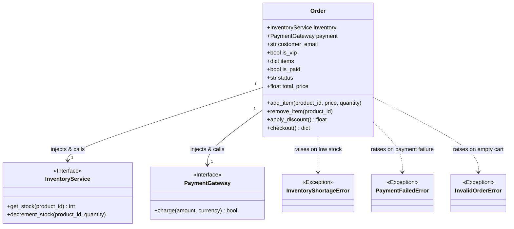
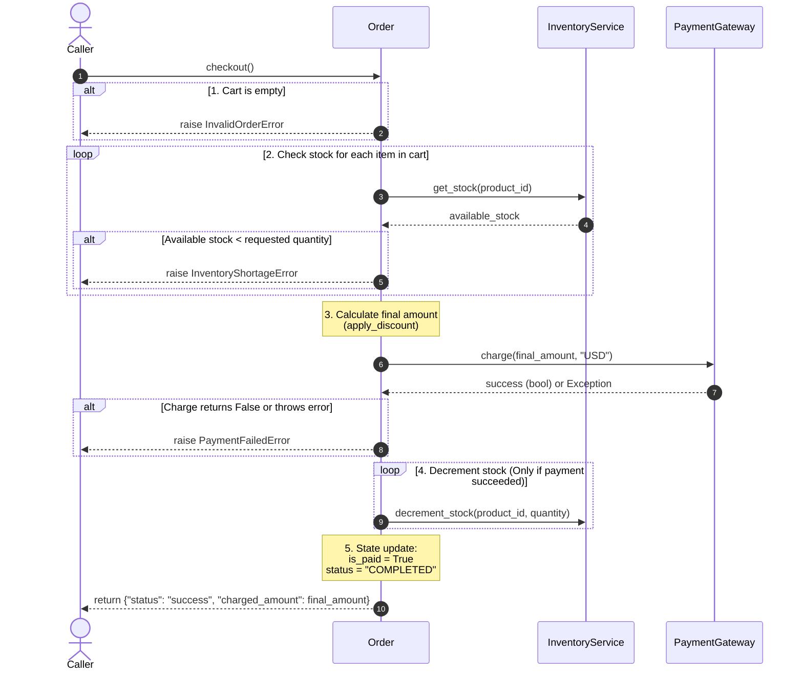
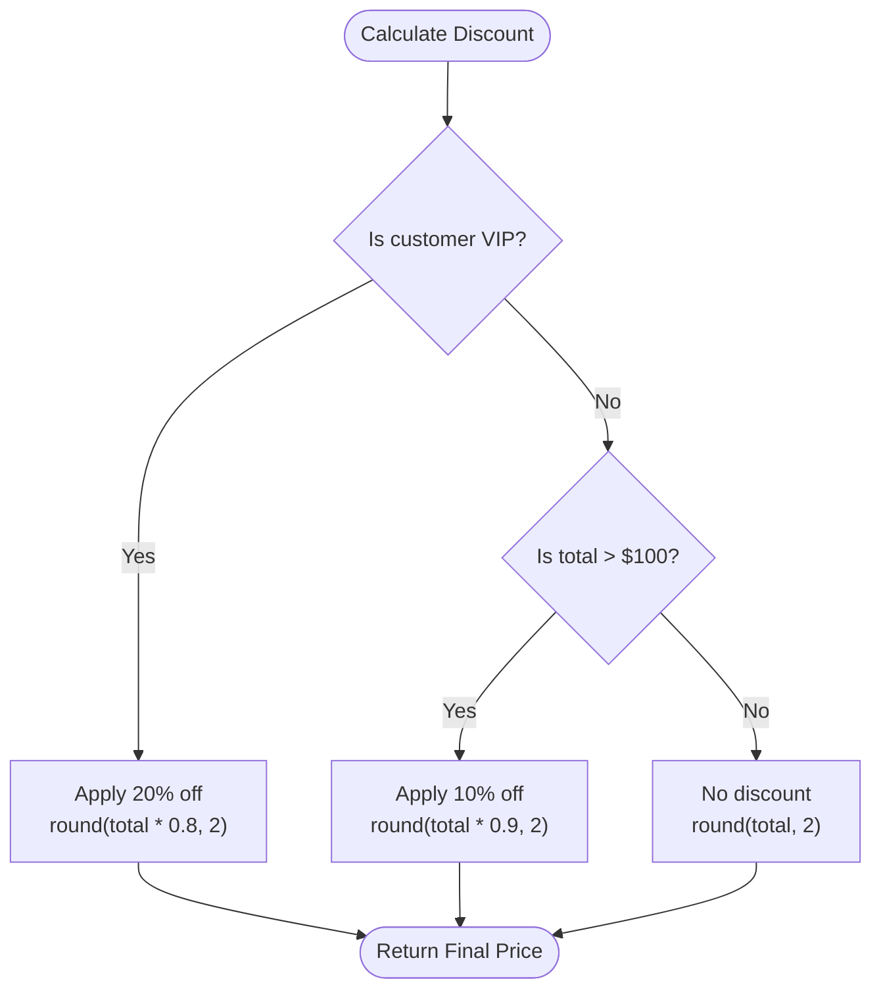

Here are visual diagrams illustrating the structure of the [`Order`](file:///Users/jimtyhurst/src/gemini/20260725-agent-engineering/agent_engineering/my-work/class-02/agy2-pprojects/mock-tests/order_service.py#L32-L123) class, its dependencies, and the step-by-step [`checkout()`](file:///Users/jimtyhurst/src/gemini/20260725-agent-engineering/agent_engineering/my-work/class-02/agy2-pprojects/mock-tests/order_service.py#L85-L123) sequence.

---

### 1. Class & Dependency Structure

This class diagram highlights the **Dependency Injection** pattern, showing how [`Order`](file:///Users/jimtyhurst/src/gemini/20260725-agent-engineering/agent_engineering/my-work/class-02/agy2-pprojects/mock-tests/order_service.py#L32-L123) depends on external service interfaces ([`InventoryService`](file:///Users/jimtyhurst/src/gemini/20260725-agent-engineering/agent_engineering/my-work/class-02/agy2-pprojects/mock-tests/order_service.py#L17-L25) and [`PaymentGateway`](file:///Users/jimtyhurst/src/gemini/20260725-agent-engineering/agent_engineering/my-work/class-02/agy2-pprojects/mock-tests/order_service.py#L26-L30)) and which exceptions it may raise.

---

### 2. Checkout Workflow (Sequence Diagram)

This sequence diagram details the precise execution path when [`checkout()`](file:///Users/jimtyhurst/src/gemini/20260725-agent-engineering/agent_engineering/my-work/class-02/agy2-pprojects/mock-tests/order_service.py#L85-L123) is called:

---

### 3. Discount Logic Decision Tree

This flowchart summarizes how [`apply_discount()`](file:///Users/jimtyhurst/src/gemini/20260725-agent-engineering/agent_engineering/my-work/class-02/agy2-pprojects/mock-tests/order_service.py#L69-L83) calculates the final amount:

